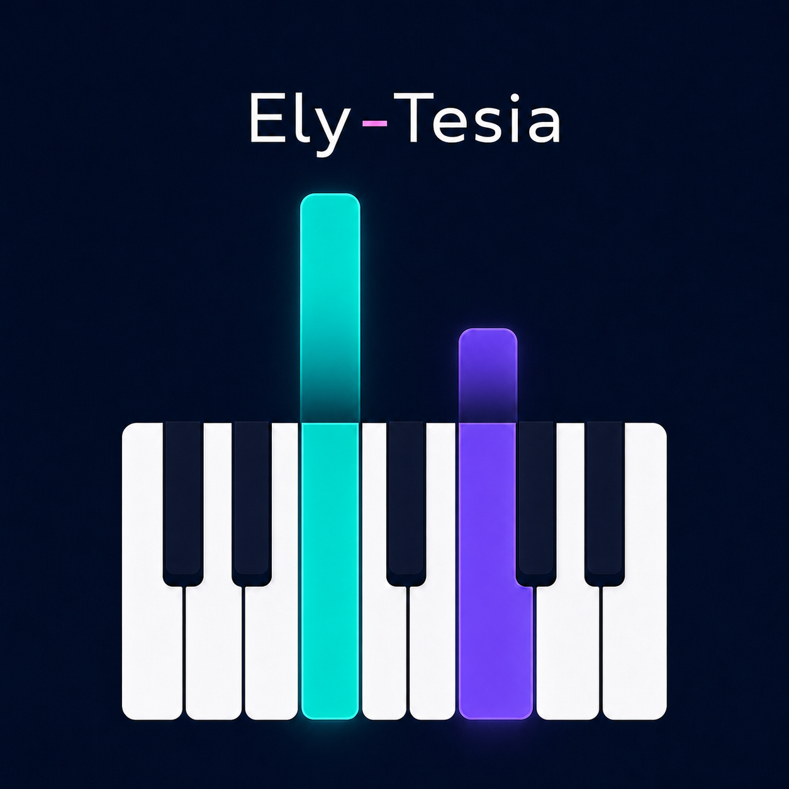

# Ely-Tesia

Ely-Tesia es un visualizador y herramienta de práctica MIDI para Windows y
Android, construido con Kotlin y Compose Multiplatform. Muestra las notas como
barras descendentes sobre un teclado, permite controlar la reproducción y
puede trabajar con un teclado MIDI físico en Windows.



## Funciones de la versión 1.0.5

- Carga y visualización de archivos MIDI en Windows y Android.
- Piano roll animado y teclado virtual interactivo.
- Entrada desde teclados MIDI físicos en Windows y Android.
- Compatibilidad con teclados Android mediante USB/OTG y Bluetooth MIDI.
- Sintetizador interno de baja latencia en Windows y Android.
- Selección de salida de audio en Windows.
- Alternancia entre el sonido interno y el sonido local del teclado.
- Reproducción, pausa, detención y reinicio.
- Modo de espera para practicar las notas mostradas.
- Control de BPM y velocidad de reproducción.
- Metrónomo.
- Reproducción en bucle con una pausa de cinco segundos.
- Barra de progreso interactiva con posición actual y duración.
- Mapeo del rango de teclas.
- Biblioteca local persistente.
- Grabación de interpretaciones desde el teclado MIDI o virtual.
- Cuenta previa configurable de cero, uno o dos compases.
- Reproducción, renombrado y exportación de grabaciones MIDI.
- Pedal sustain CC64 en entrada, grabación, reproducción y exportación.
- Interfaz adaptada para escritorio y teléfonos.
- Colores sincronizados por pista en barras, partículas y teclas.
- Evaluación visual de notas correctas e incorrectas con tolerancia temporal.
- Retención del color de cada pulsación hasta soltar la tecla.
- Gestor de temas con Aurora, Clásico y Alto Contraste.
- Importación y exportación de temas comunitarios `.elytheme.json`.
- Colores configurables para manos, teclas blancas, negras/bemoles, pulsaciones,
  errores, estelas y partículas.
- Material 3, movimiento expresivo y Dynamic Color opcional en Android 12+.
- Pantalla activa durante reproducción y grabación en Android.
- APK y AAB release firmados con identidad permanente.

## Descargas

Los paquetes generados se guardan en la carpeta `release/`:

- `ElyTesia-Windows-1.0.5.msi`
- `ElyTesia-Windows-1.0.5.exe`
- `ElyTesia-Windows-1.0.5.msix`
- `ElyTesia-Android-1.0.5.apk`
- `ElyTesia-Android-1.0.5.aab`
- `SHA256SUMS.txt`

La versión 1.0.5 inaugura la firma Android estable. Si el dispositivo tiene una
versión anterior firmada como debug, Android pedirá desinstalarla una sola vez;
desde 1.0.5 las actualizaciones directas conservarán la misma identidad.

## Compilar el proyecto

### Requisitos

- Windows 10 u 11 para generar el instalador MSI.
- JDK 17 completo con `jpackage`.
- Android SDK 34 para generar el APK.
- Windows SDK con `MakeAppx.exe` y `SignTool.exe` para generar y firmar MSIX.

El script busca primero Microsoft OpenJDK 17 y utiliza el Android SDK definido
en `ANDROID_HOME` o instalado en `%LOCALAPPDATA%\Android\Sdk`.

### Generar todos los paquetes

Antes de la primera release Android, genera la identidad permanente:

```powershell
.\scripts\setup-android-signing.ps1
```

Guarda una copia privada conjunta de `signing/elytesia-release.jks` y
`keystore.properties`. Ambos están ignorados por Git y perderlos impediría
publicar actualizaciones compatibles.

Desde PowerShell, en la raíz del proyecto:

```powershell
.\build-release.ps1
```

Para generar solamente una plataforma:

```powershell
.\build-release.ps1 -SkipAndroid
.\build-release.ps1 -SkipWindows
.\build-release.ps1 -SkipMsix
```

Para firmar el MSIX durante el build, proporciona el certificado sin guardar su
contraseña en el repositorio:

```powershell
$password = Read-Host "Contraseña del certificado" -AsSecureString
.\build-release.ps1 -MsixCertificate "C:\certificados\ElyTesia.pfx" -MsixCertificatePassword $password
```

Para Microsoft Store, el valor `Publisher` del manifiesto debe coincidir
exactamente con la identidad asignada a Ely-Tesia en Partner Center.

### Ejecutar la aplicación de escritorio

```powershell
$env:JAVA_HOME="C:\Program Files\Microsoft\jdk-17.0.19.10-hotspot"
.\gradlew.bat :composeApp:run
```

## Datos locales

En Windows, la biblioteca, las canciones importadas, el rango mapeado y las
preferencias se almacenan en:

```text
%APPDATA%\Ely-Tesia\state.txt
```

En Android se utiliza el almacenamiento privado de la aplicación.

## Temas comunitarios

Abre **Temas** dentro de la aplicación para aplicar, importar, exportar o
eliminar un tema comunitario. Los temas usan JSON UTF-8 con la extensión
`.elytheme.json`; no contienen código ni recursos remotos y se validan antes de
instalarse.

La guía, las reglas, el esquema y tres ejemplos listos para modificar están en
[`docs/themes/`](docs/themes/README.md).

## Estado del proyecto

Ely-Tesia comenzó como un experimento y continúa en desarrollo. Entre las
funciones previstas están el control avanzado de manos y pistas, el bucle de sección
A-B, las estadísticas de práctica y una biblioteca comunitaria opcional.

Las funciones previstas y las ideas que todavía están en evaluación se
mantienen en el [roadmap del proyecto](ROADMAP.md).

## Licencia

Este proyecto se distribuye bajo la [licencia MIT](LICENSE).
